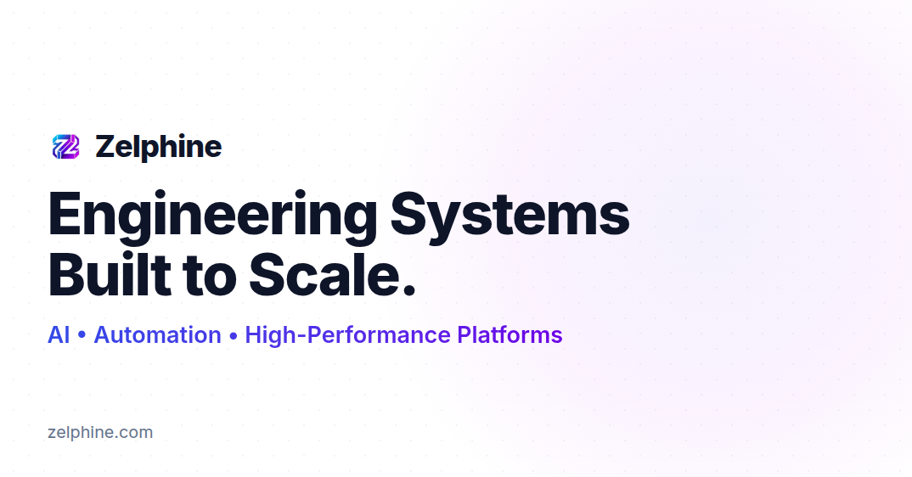

# Zelphine | High-Performance Digital Architecture



> **A Next.js 15 Engineering Showcase.** > This repository demonstrates a production-grade architecture for a modern digital agency. It features dynamic SEO, a headless CMS pipeline, and strict type safety—engineered for scale, speed, and Google dominance.

[](https://zelphine.com)
[-black?style=for-the-badge&logo=next.js)](https://nextjs.org/)
[](https://www.typescriptlang.org/)
[](https://www.sanity.io/)

---

## The Engineering Philosophy

This is not just a landing page; it is a **Scalable Content Platform**. The goal was to build a system that allows non-technical teams to manage complex content (Case Studies & Insights) while maintaining a perfect 100/100 Lighthouse score.

### Why this Stack?

| Decision | Reasoning |
| :--- | :--- |
| **Next.js 15 (App Router)** | Leverages React Server Components (RSC) to minimize client-side JavaScript bundle size, ensuring instant First Contentful Paint (FCP). |
| **Sanity.io (Headless)** | Chosen over traditional CMS for its structured content lake. Allows us to query data via GROQ with precise filtering for "Case Studies" vs. "Blogs". |
| **Edge Runtime** | Used for dynamic Open Graph image generation (`og-image.tsx`), creating custom social cards on the fly without external APIs. |
| **Strict TypeScript** | End-to-end type safety from the CMS query result to the React component prop, preventing runtime errors in production. |

---

##  Key Technical Features

### 1. Advanced SEO Engine
- **Dynamic Sitemaps:** auto-generates `sitemap.xml` by fetching routes from Sanity.
- **Smart Indexing:** Custom `robots.ts` secures the `/studio` (Admin) route while exposing content.
- **Rich Results:** Injects `JSON-LD` Schema for "ProfessionalService" to trigger Google Knowledge Panels.
- **Zero-Layout Shift:** Enforced aspect ratios on all media to prevent CLS penalties.

### 2. Intelligent Content Pipeline
- **Dual-Stream Publishing:** A single Sanity backend feeds two distinct frontend routes:
  - `/case-studies`: Projects tagged "Case Study".
  - `/insights`: Articles *excluding* Case Studies (to prevent duplicate content).
- **On-Demand Revalidation:** Uses Next.js ISR (Incremental Static Regeneration) with a 3600s revalidation window.

### 3. Dynamic Social Preview
- **Code-Generated Images:** `app/opengraph-image.tsx` generates branded social cards using CSS-in-JS (via `next/og`), ensuring every link shared on LinkedIn looks premium.

---

##  Architecture Overview

```bash
├── app/
│   ├── (routes)/          # Public Pages (Home, Services)
│   ├── case-studies/      # Dynamic Route: [slug]/page.tsx
│   ├── insights/          # Dynamic Route: [slug]/page.tsx
│   ├── api/               # Server-side API endpoints
│   ├── studio/            # Embedded Sanity CMS Dashboard
│   ├── sitemap.ts         # Dynamic XML Generator (Server-side)
│   ├── robots.ts          # Crawler Directives
│   └── layout.tsx         # Global Shell (Fonts, SEO, Analytics)
├── components/
│   ├── layout/            # Semantic Header/Footer (<nav>, <footer>)
│   ├── majorUi/           # Complex UI (Hero, Bento Grids)
│   └── seo/               # JSON-LD Injectors
├── sanity/                # Content Schema & GROQ Queries
└── lib/                   # Utility functions & Zod Schemas